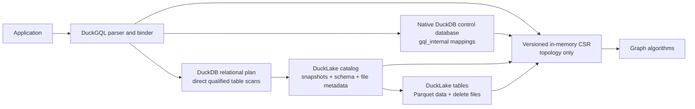
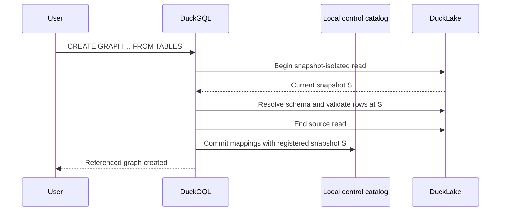
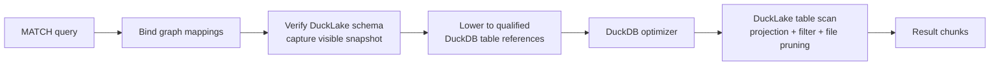
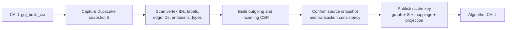

# Zero-copy DuckLake graph integration

## Document status

This document proposes a DuckLake-backed storage mode for DuckGQL. It is a
design, not an implemented feature or an ISO GQL conformance claim.

The objective is to query and process graph-shaped DuckLake tables without
copying their vertices, edges, or properties into `gql_data`.

## Executive decision

Add a **referenced graph** storage mode:

- DuckLake remains the authoritative persistent store.
- DuckGQL stores only graph mappings and source-version metadata.
- Relational `MATCH` scans fully qualified DuckLake tables directly.
- GQL mutations are rejected in the first release.
- CSR algorithms explicitly materialize only topology into an immutable
  in-memory snapshot.
- DuckLake snapshot IDs, rather than the local DuckGQL `graph_version`, control
  referenced-graph cache freshness.

This preserves the existing DuckGQL execution model. The extension does not
become a lakehouse reader, copy DuckLake metadata internally, or bypass
DuckDB's DuckLake extension.

## What “zero copy” means

The proposed mode eliminates a second **persistent graph copy**:

| Data | Copied into native DuckDB tables? | Materialized elsewhere? |
|---|---:|---|
| Vertex rows and properties | No | Read from DuckLake by DuckDB |
| Edge rows and properties | No | Read from DuckLake by DuckDB |
| Graph table/column mappings | Not applicable | Small rows in `gql_internal` |
| Fixed `MATCH` intermediates | No persistent copy | Normal DuckDB operators may buffer or spill |
| CSR topology | No persistent copy by default | Explicit in-memory derived snapshot |
| Algorithm scratch space | No persistent copy | Per-call memory |

CSR is necessarily a materialized adjacency representation. The no-copy
guarantee applies to authoritative persistent graph data, not to temporary
query state or explicitly requested algorithm acceleration.

## Why this fits DuckGQL

The current binder already resolves graph tables to:

```text
catalog_name.schema_name.table_name
```

The relational lowerer then creates fully qualified DuckDB table references.
That boundary is storage-independent: a reference can identify a native
DuckDB table or a table in an attached DuckLake catalog.

The work is therefore primarily:

1. catalog and ownership changes;
2. public graph-definition syntax;
3. referenced-table validation;
4. mutation guards;
5. DuckLake snapshot-aware cache invalidation;
6. CSR support for referenced keys.

The fixed-pattern relational engine does not need to be replaced.

## Target architecture



### Component responsibilities

| Component | Responsibility |
|---|---|
| DuckLake | Authoritative rows, properties, snapshots, files, deletes, schema evolution |
| DuckDB DuckLake extension | Catalog attachment, transactions, snapshot isolation, table scans, file pruning |
| DuckGQL control catalog | Graph names, table roles, key/endpoint/label/property mappings, source policy |
| DuckGQL relational lowerer | Translate GQL into ordinary qualified DuckDB scans and joins |
| DuckGQL CSR builder | Scan required key/topology columns at one source snapshot |
| DuckGQL algorithms | Execute against the immutable versioned CSR |

## Deployment model

DuckLake and DuckGQL remain separate extensions built for the same DuckDB
version and platform.

```sql
INSTALL ducklake;
LOAD ducklake;
LOAD duckgql;

ATTACH 'ducklake:lakehouse.ducklake' AS lake;
```

The repository currently targets DuckDB `v1.5.4`. DuckLake v1.0 is documented
as supported by DuckDB `v1.5.2` and later, but CI must still test the exact
DuckDB/DuckLake/DuckGQL combination before release.

DuckGQL should depend only on public DuckDB catalog and SQL interfaces. It
should not link against private DuckLake C++ classes. An attached source can be
identified through `duckdb_databases().type = 'ducklake'`, and source snapshots
can be obtained through the attached catalog's public functions.

## Control database

The DuckGQL catalog should remain in a small native DuckDB database:

```sh
duckdb graph-control.duckdb
```

Then attach DuckLake inside that session:

```sql
ATTACH 'ducklake:lakehouse.ducklake' AS lake;
```

This control database stores mappings only. It does not contain graph rows.

Keeping control metadata outside DuckLake is deliberate:

- the existing catalog uses sequences, primary keys, uniqueness, and checks;
- DuckLake does not support sequences, indexes, or enforced primary, unique,
  or foreign-key constraints;
- graph registration should not create a DuckLake data snapshot that then
  invalidates the graph it just registered;
- DuckLake connection strings and credentials should remain deployment
  configuration rather than stored graph metadata.

For ephemeral use, the control catalog may live in `memory`, but graph
definitions then need to be recreated on every process start.

DuckLake can be shared by multiple processes, but a native DuckDB control file
should not be assumed to provide the same multi-writer deployment model.
Multi-process services should keep graph DDL as an idempotent deployment
artifact and create equivalent local mappings per process. A future shared
control-catalog provider can be designed separately if centralized graph
definitions become necessary.

## Source table contract

The first implementation supports one vertex table and one edge table from the
same attached DuckLake catalog.

Example source tables:

```sql
CREATE TABLE lake.main.person (
    person_id BIGINT NOT NULL,
    label VARCHAR NOT NULL,
    name VARCHAR,
    age BIGINT
);

CREATE TABLE lake.main.knows (
    edge_id BIGINT NOT NULL,
    source_person_id BIGINT NOT NULL,
    target_person_id BIGINT NOT NULL,
    edge_type VARCHAR NOT NULL,
    since BIGINT
);
```

DuckLake cannot enforce uniqueness or foreign keys, so these are source-data
contracts:

- `person.person_id` is unique and stable;
- `knows.edge_id` is unique and stable;
- every source and target ID refers to a vertex ID;
- keys never change their meaning between snapshots;
- label and type values follow the registered mapping.

### Initial key boundary

For the first release:

- vertex and edge keys must be non-negative integer types that cast losslessly
  to `UBIGINT`;
- source and target endpoint types must exactly match the vertex key type;
- vertex labels and edge types must use one scalar `VARCHAR` column;
- keys must be non-null and unique;
- endpoints must be non-null and valid.

This boundary matches the current CSR and algorithm APIs. Fixed relational
`MATCH` could theoretically support other comparable scalar key types, but
supporting string, UUID, or composite IDs consistently across element
projection, recursive paths, CSR, and algorithm output requires a broader
element-identity design.

Never synthesize a persistent edge ID with `row_number()`. File compaction,
deletes, and new snapshots can change row order. A stable source key is
required.

## Proposed public DDL

The preferred API is declarative graph DDL, not restoration of the removed
`gql_register_graph_tables` compatibility function.

Proposed DuckGQL extension syntax:

```sql
CREATE GRAPH social FROM TABLES (
    VERTEX TABLE lake.main.person
        KEY (person_id)
        LABEL COLUMN label
        PROPERTIES (name, age),

    EDGE TABLE lake.main.knows
        KEY (edge_id)
        SOURCE (source_person_id)
            REFERENCES lake.main.person (person_id)
        DESTINATION (target_person_id)
            REFERENCES lake.main.person (person_id)
        TYPE COLUMN edge_type
        PROPERTIES (since)
)
OPTIONS (
    SNAPSHOT_POLICY 'LIVE',
    ACCESS_MODE 'READ_ONLY',
    VALIDATE TRUE
);
```

This syntax is a DuckGQL design proposal. Its final grammar must be reconciled
with the project's ISO GQL DDL roadmap before implementation.
`SOURCE_KIND` is inferred from the attached catalog and is not trusted as a
user-supplied option.

### Label and type mappings

The DDL should support three mappings already anticipated by the internal
catalog:

```text
STATIC          one label/type implied by the table
SCALAR_COLUMN   one VARCHAR column
LIST_COLUMN     one VARCHAR[] column
```

Examples:

```sql
VERTEX TABLE lake.main.person
    KEY (person_id)
    LABEL Person

VERTEX TABLE lake.main.entity
    KEY (entity_id)
    LABELS COLUMN labels

EDGE TABLE lake.main.knows
    KEY (edge_id)
    TYPE Knows
```

`STATIC` is preferable when a table already represents one element kind.
`LIST_COLUMN` avoids splitting semicolon-delimited strings during every
relational label predicate.

### Property mappings

Properties should be explicit by default:

```sql
PROPERTIES (
    full_name AS name,
    birth_year AS born
)
```

An optional `PROPERTIES ALL EXCEPT (...)` convenience can be added later.
Explicit mappings:

- keep the public graph schema stable when DuckLake adds columns;
- avoid exposing operational columns accidentally;
- allow GQL names to differ from physical column names;
- produce an exact schema fingerprint.

## Catalog changes

### Preserve `TABLE_BACKED`

Both managed and referenced graphs remain table-backed. The storage mode should
continue to describe the execution model:

```text
EMPTY
TABLE_BACKED
```

Ownership determines lifecycle behavior:

```text
MANAGED       DuckGQL owns and drops the physical tables
REFERENCED    DuckGQL owns only mappings and never drops the source tables
```

Change the `graph_element_tables` ownership check to:

```sql
CHECK (ownership IN ('MANAGED', 'REFERENCED'))
```

Referenced rows use `access_mode = 'READ_ONLY'` in the first release.

### Add `graph_sources`

Proposed control-catalog table:

```sql
CREATE TABLE gql_internal.graph_sources (
    graph_id                   UBIGINT PRIMARY KEY,
    source_kind                VARCHAR NOT NULL,
    source_catalog             VARCHAR NOT NULL,
    snapshot_policy            VARCHAR NOT NULL,
    pinned_snapshot_id         UBIGINT,
    registered_snapshot_id     UBIGINT NOT NULL,
    last_validated_snapshot_id UBIGINT,
    schema_fingerprint         VARCHAR NOT NULL,
    access_mode                VARCHAR NOT NULL,
    CHECK (source_kind IN ('DUCKDB', 'DUCKLAKE')),
    CHECK (snapshot_policy IN ('LIVE', 'PINNED')),
    CHECK (access_mode IN ('READ_ONLY', 'READ_WRITE')),
    CHECK (
        (snapshot_policy = 'LIVE' AND pinned_snapshot_id IS NULL)
        OR
        (snapshot_policy = 'PINNED' AND pinned_snapshot_id IS NOT NULL)
    )
);
```

The first release creates only:

```text
source_kind     = DUCKLAKE
snapshot_policy = LIVE
access_mode     = READ_ONLY
```

`schema_fingerprint` covers resolved table names, structural mappings, property
mappings, column names, logical types, and nullability. It detects incompatible
schema evolution without scanning graph rows.

### Reuse existing mapping tables

The existing tables remain useful:

- `graphs`;
- `graph_storage`;
- `graph_element_tables`;
- `graph_edge_endpoints`;
- `graph_label_mappings`;
- `graph_property_mappings`.

No per-graph vertex or edge sequence is created for a referenced graph.

### Binding structures

Extend `GqlTableGraphBinding` with source metadata:

```cpp
enum class GqlTableOwnership : uint8_t { MANAGED, REFERENCED };
enum class GqlSourceKind : uint8_t { DUCKDB, DUCKLAKE };
enum class GqlSnapshotPolicy : uint8_t { LIVE, PINNED };

struct GqlGraphSourceBinding {
    GqlSourceKind source_kind;
    GqlSnapshotPolicy snapshot_policy;
    string source_catalog;
    bool has_pinned_snapshot;
    uint64_t pinned_snapshot_id;
    uint64_t observed_snapshot_id;
    string schema_fingerprint;
    bool writable;
};
```

Element bindings also need ownership and access mode so `DROP GRAPH` and
mutation binding do not infer behavior from table names.

## Registration lifecycle

Registration reads DuckLake and writes only the local control catalog. It
validates one snapshot-isolated source view. It records that view's snapshot
ID, but it does not claim a cross-catalog atomic commit with DuckLake. A live
source may advance immediately after registration; bind-time schema checks and
snapshot-aware CSR cache keys handle that normal case.



Detailed steps:

1. Require the named source catalog to be attached.
2. Verify `duckdb_databases().type = 'ducklake'`.
3. Start a DuckLake read transaction and read
   `FROM <catalog>.current_snapshot()` as snapshot `S`.
4. Resolve all tables and columns through DuckDB catalog APIs.
5. Verify structural type compatibility.
6. Build the schema fingerprint.
7. If requested, scan uniqueness and endpoint validity within snapshot `S`.
8. End the source read transaction.
9. Commit local graph, source, element, endpoint, label, and property mappings
    with `registered_snapshot_id = S`.

For a `LIVE` graph, the source can already be at `S + 1` when registration
returns. That is expected: the next bind validates the visible schema, and any
prepared CSR is keyed by the visible DuckLake snapshot. A `PINNED` graph
continues to resolve snapshot `S`.

Registration must not store:

- DuckLake metadata connection strings;
- object-storage URLs;
- secrets or credentials;
- DuckLake's private metadata-table layout.

It stores the attached catalog alias and expects deployments to attach that
logical alias before using the graph.

## Validation policy

DuckLake supports `NOT NULL` but not enforced uniqueness or foreign keys.
DuckGQL must distinguish schema validation from row validation.

### Always-on schema validation

At registration and bind time:

- source catalog is attached and is a DuckLake catalog;
- source tables exist;
- mapped columns exist;
- column types match the recorded mappings;
- endpoint and vertex key types match;
- schema fingerprint is unchanged.

This validation is metadata-only.

### Registration row validation

With `VALIDATE TRUE`, registration scans:

```sql
-- Unique, non-null vertex key
SELECT count(*), count(person_id), count(DISTINCT person_id)
FROM lake.main.person;

-- Unique, non-null edge key
SELECT count(*), count(edge_id), count(DISTINCT edge_id)
FROM lake.main.knows;

-- Valid source and target endpoints
SELECT count(*)
FROM lake.main.knows AS e
LEFT JOIN lake.main.person AS s ON e.source_person_id = s.person_id
LEFT JOIN lake.main.person AS t ON e.target_person_id = t.person_id
WHERE e.source_person_id IS NULL
   OR e.target_person_id IS NULL
   OR s.person_id IS NULL
   OR t.person_id IS NULL;
```

This proves the contract only for the registered snapshot.

### Later snapshots

For a live graph:

- every bind performs cheap schema validation;
- `MATCH` trusts the registered source-data contract for new rows;
- CSR construction validates keys and endpoints while it builds;
- `ALTER GRAPH ... REFRESH VALIDATE` can run the full scans and update
  `last_validated_snapshot_id`.

A future strict policy may require full validation before first use of every
new snapshot, but that can turn an unrelated query into an unbounded scan and
should not be the initial default.

## Zero-copy `MATCH`

The query path is:



For:

```sql
SESSION SET GRAPH social;

MATCH (a:Person)-[e:Knows]->(b:Person)
WHERE a.age >= 40
RETURN a.name, b.name, e.since;
```

the relational plan addresses:

```text
lake.main.person AS a
lake.main.knows  AS e
lake.main.person AS b
```

and joins:

```text
e.source_person_id = a.person_id
e.target_person_id = b.person_id
```

Only referenced columns are projected. DuckDB and the DuckLake extension remain
responsible for Parquet projection, filters, delete files, partition pruning,
file-level statistics, and transaction visibility.

DuckGQL must not call `ducklake_list_files` and scan the returned Parquet paths
as an alternative query engine. Doing so would duplicate DuckLake logic and
risk mishandling deletes, encryption, schema mapping, and snapshot visibility.

## Snapshot semantics

DuckLake represents each committed transaction as a snapshot and exposes the
visible snapshot through:

```sql
FROM lake.current_snapshot();
```

### Live graphs

`SNAPSHOT_POLICY 'LIVE'` means each statement uses the DuckLake snapshot visible
to that transaction.

- one `MATCH` statement reads a consistent DuckLake state;
- a later statement may observe a newer snapshot;
- no local DuckGQL metadata update is required for data-only source changes;
- schema changes are accepted only when the schema fingerprint remains
  compatible.

### Pinned graphs

`SNAPSHOT_POLICY 'PINNED'` is a later phase. It binds a graph to one DuckLake
snapshot:

```sql
SELECT * FROM lake.main.person AT (VERSION => 42);
```

Implementation choices:

1. add a version clause to every lowered DuckLake table reference; or
2. require a DuckLake catalog attached with `SNAPSHOT_VERSION 42` and register
   against that catalog alias.

The second option is simpler for the first pinned prototype because the
DuckLake attachment itself supplies a consistent historical catalog.

If the pinned snapshot has been expired, graph use must fail with an actionable
error. DuckGQL must never silently fall forward to the latest snapshot.

## CSR construction and freshness

The CSR path does materialize topology, but it does not copy source properties
or create persistent graph tables.



### Cache key

For referenced graphs:

```text
control_database_identity
graph_id
DuckLake catalog identity
DuckLake snapshot_id
graph schema_version
algorithm projection options
```

The local `graphs.graph_version` remains authoritative for managed graphs. It
is not a sufficient freshness token for referenced graphs because DuckLake may
be updated by another connection or process.

### Initial invalidation policy

Use the DuckLake catalog-wide `current_snapshot()` ID. Any new DuckLake snapshot
invalidates the referenced graph's prepared CSR conservatively, even if the
snapshot changed an unrelated table.

This is simple and correct.

### Later table-specific fingerprint

If conservative invalidation causes excessive rebuilds, compute a source
signature for only the registered tables using DuckLake's public file-listing
API:

```sql
FROM ducklake_list_files(
    'lake',
    'person',
    schema => 'main',
    snapshot_version => 42
);
```

The signature must include data files, delete files, sizes, schema fingerprint,
and relevant table identity. It is an optimization after the catalog-wide
snapshot policy is correct.

### Identity handling

The current CSR builder already:

- handles dense `1..N` IDs without an ordinal hash map;
- builds a sparse `UBIGINT`-to-ordinal map otherwise;
- validates generic table keys and endpoints while scanning.

The managed-table optimization that skips edge-ID duplicate checking must not
apply to referenced DuckLake tables.

## Mutation policy

### First release: read-only

Reject these operations for `ownership = 'REFERENCED'`:

- `INSERT`;
- matched `INSERT`;
- `SET`;
- `REMOVE`;
- `DELETE`;
- `DETACH DELETE`;
- compatibility `MERGE`.

The diagnostic should identify the graph as a read-only referenced graph and
direct the caller to mutate the DuckLake tables using DuckDB/DuckLake SQL.

Read-only is the correct first boundary because:

- current mutation code requires canonical structural columns;
- current insert and merge paths allocate IDs with DuckDB sequences;
- DuckLake does not support sequences;
- DuckLake does not enforce uniqueness or foreign keys;
- the local DuckGQL catalog and DuckLake cannot be treated as one atomic
  writable storage engine;
- external writers can create new DuckLake snapshots independently.

### Future write-through

Write-through can be added only with an explicit identity policy:

- caller-supplied stable IDs;
- application-provided ID allocation service; or
- another source-native strategy that remains unique across writers.

One GQL command would execute entirely inside one DuckLake transaction, which
becomes one source snapshot. CSR freshness would still use the resulting
DuckLake snapshot ID, avoiding a fragile dual write to local `graph_version`.

Write-through must not depend on unsupported DuckLake indexes, sequences, or
enforced key constraints.

## Drop, detach, and recovery behavior

### `DROP GRAPH`

For a referenced graph:

- delete DuckGQL mappings and source metadata;
- clear selected-graph state;
- evict referenced CSR projections when unreferenced;
- never drop, alter, or delete from DuckLake source tables.

For managed graphs, existing ownership behavior remains unchanged.

### Missing attachment

If the expected DuckLake alias is not attached:

```text
Referenced graph 'social' requires DuckLake catalog 'lake';
attach it before selecting or querying the graph
```

DuckGQL should not attach automatically because the graph catalog does not
store connection strings or credentials.

### Source table or schema changes

- missing table: fail binding;
- missing or incompatible mapped column: fail schema validation;
- compatible added column: ignore until explicitly mapped;
- renamed table: fail until graph metadata is altered;
- expired pinned snapshot: fail without fallback;
- changed data snapshot: relational reads continue; CSR requires a matching
  rebuilt snapshot.

### Refresh operation

Proposed DDL:

```sql
ALTER GRAPH social REFRESH;
ALTER GRAPH social REFRESH VALIDATE;
```

`REFRESH` re-resolves source metadata and accepts only compatible mappings.
`REFRESH VALIDATE` also runs key and endpoint scans. Neither copies source rows.

## DuckLake physical-layout guidance

DuckLake does not provide indexes. Referenced-graph performance depends on
Parquet projection, file statistics, partitioning, sort order, and CSR reuse.

Recommended layouts:

- keep vertex and edge keys as narrow non-null integers;
- use `VARCHAR[]` labels or static table labels;
- keep one scalar edge type when possible;
- sort vertex tables by the vertex key;
- sort edge tables by source ID and then target ID for outbound workloads;
- consider separate edge tables by relationship type;
- partition large heterogeneous tables by stable coarse labels or types;
- benchmark bucket partitioning on source ID for selective anchored workloads;
- compact small files so graph scans do not become metadata-bound.

DuckLake sorting improves file-level min/max pruning. Partitioning also applies
to newly written files and can improve pruning. These are source-table design
choices; DuckGQL should inspect and benchmark them, not silently rewrite the
lake layout.

Reverse traversal may not benefit from a source-sorted edge table. Repeated
bidirectional topology workloads should use the explicit CSR snapshot, which
already stores incoming and outgoing adjacency.

## Security and operational boundaries

- Do not persist secrets, tokens, object-store URLs, or metadata-database
  credentials in `gql_internal`.
- Require the deployment to attach DuckLake under the registered logical alias.
- Honor DuckDB and DuckLake read-only attachment state.
- Use DuckDB catalog qualification for every source reference.
- Never construct raw Parquet paths from user input.
- Avoid depending on DuckLake private metadata tables or hidden attached
  catalog names.
- Record source kind, visible snapshot, and mapping fingerprint in diagnostics.

## Introspection

Extend graph introspection with:

```sql
SELECT * FROM gql_graph_sources();
```

Proposed output:

| Column | Meaning |
|---|---|
| `graph_name` | DuckGQL graph |
| `ownership` | `MANAGED` or `REFERENCED` |
| `source_kind` | `DUCKDB` or `DUCKLAKE` |
| `source_catalog` | Required attached alias |
| `snapshot_policy` | `LIVE` or `PINNED` |
| `pinned_snapshot_id` | Historical version when pinned |
| `observed_snapshot_id` | Snapshot visible to the current connection |
| `last_validated_snapshot_id` | Last snapshot receiving full row validation |
| `schema_valid` | Whether mappings still match |
| `access_mode` | `READ_ONLY` or `READ_WRITE` |

Extend `gql_csr_stats` with:

- source kind;
- source snapshot ID;
- schema version;
- cache scope;
- cache hit/miss status.

## Implementation plan

### Phase 0: catalog and source abstraction

1. Add an explicit catalog migration framework.
2. Expand ownership to `MANAGED | REFERENCED`.
3. Add `graph_sources`.
4. Add source and ownership fields to graph bindings.
5. Refactor managed attachment into a storage-neutral mapping writer.
6. Branch `DROP GRAPH` behavior on ownership.

Exit gate:

- existing managed graph tests remain unchanged;
- old databases migrate explicitly;
- referenced metadata can be created and dropped without touching sources.

### Phase 1: read-only DuckLake `MATCH`

1. Parse the table-backed graph DDL.
2. Detect attached DuckLake catalogs through public DuckDB metadata.
3. Resolve and validate one vertex and one edge table.
4. Store explicit property and label mappings.
5. Add cheap bind-time schema fingerprint checks.
6. Reuse the existing relational and recursive lowerer.
7. Reject every mutation for referenced ownership.

Exit gate:

- no `gql_data` tables or graph ID sequences are created;
- fixed and recursive `MATCH` return the same result as equivalent DuckLake SQL;
- `DROP GRAPH` leaves DuckLake unchanged;
- detached and changed-source diagnostics are deterministic.

### Phase 2: snapshot-aware CSR

1. Add a DuckLake source-version provider using `current_snapshot()`.
2. Key CSR snapshots by source snapshot and mapping schema version.
3. Validate referenced IDs and endpoints during build.
4. Never use the managed edge-ID fast path for referenced sources.
5. Reject stale snapshots and expose source versions in stats.
6. Add pinned-snapshot support.

Exit gate:

- relational reads and CSR use consistent source snapshots;
- a new DuckLake commit makes an old CSR unavailable;
- rebuilding produces results for the new snapshot;
- unrelated local `graph_version` changes do not control DuckLake freshness.

### Phase 3: richer graph mappings

1. Support `STATIC`, `SCALAR_COLUMN`, and `LIST_COLUMN` labels/types.
2. Support multiple vertex and edge tables.
3. Add table pruning by static label and type.
4. Add table-specific source fingerprints if catalog-wide invalidation is too
   conservative.
5. Add explicit `ALTER GRAPH ... REFRESH`.

### Phase 4: optional write-through

1. Select and document a distributed identity policy.
2. Lower mutations into one DuckLake transaction.
3. Validate source-native mutation semantics.
4. Treat the committed DuckLake snapshot as the only freshness token.
5. Add concurrency, retry, and conflict tests.

Write-through is not required to deliver the zero-copy analytical use case.

## Test plan

### Offline correctness tests

Create a temporary local DuckLake in each test run:

- one vertex and one edge table;
- multiple labels and typed properties;
- duplicate and null key fixtures;
- missing endpoint fixtures;
- data update, delete, and schema-change snapshots.

Required cases:

- register, select, fixed `MATCH`, optional match, aggregation, and recursion;
- CSR build and every implemented algorithm;
- source update invalidates CSR;
- schema addition remains invisible until mapped;
- incompatible schema change fails;
- drop graph preserves source rows and tables;
- detach/reattach under the same alias works;
- mutation attempts fail before writing;
- pinned snapshot reproduces historical results;
- expired pinned snapshot fails.

Ordinary tests must not require object storage or network access.

### Integration tests

- local object-store emulator or temporary filesystem data path;
- multiple DuckDB connections observing new DuckLake snapshots;
- read-only attachment;
- compaction and delete files;
- source catalog restart;
- extension load order and version compatibility.

### Differential tests

For every GQL workload, compare against SQL over the same attached tables and
the same source snapshot.

## Benchmark plan

Measure:

| Category | Metrics |
|---|---|
| Registration | metadata time, validation time, bytes written to control DB |
| Storage | duplicated persistent graph bytes; target is zero |
| Cold `MATCH` | latency, bytes read, files scanned, peak RSS |
| Warm `MATCH` | latency and planning overhead |
| CSR build | source scan time, build time, peak RSS, stored topology bytes |
| CSR reuse | cache hit latency across repeated calls and connections |
| Snapshot update | invalidation and rebuild latency |
| Remote storage | requests, bytes transferred, latency |

Compare:

1. direct SQL over DuckLake;
2. DuckGQL referenced `MATCH`;
3. existing `COPY GRAPH` managed tables;
4. referenced CSR algorithms after build.

The referenced relational path should target low fixed overhead relative to
direct DuckLake SQL. It should not be expected to outperform a fully local,
copied, and physically optimized managed table on every query; its primary
benefit is eliminating duplicate storage and refresh pipelines.

## Acceptance criteria

The first production-worthy read-only release requires:

- zero persistent copies of vertex, edge, and property rows;
- direct qualified DuckLake scans for fixed and recursive `MATCH`;
- exact SQL/GQL differential correctness;
- snapshot-consistent reads;
- source-snapshot-aware CSR invalidation;
- strict ownership behavior on drop;
- mutation rejection before any source write;
- deterministic schema-change and missing-attachment diagnostics;
- observable source and cache versions;
- benchmarks showing bounded DuckGQL overhead over equivalent DuckLake SQL.

## Risks and mitigations

| Risk | Mitigation |
|---|---|
| DuckLake source changes outside DuckGQL | Use DuckLake snapshot ID for freshness |
| No enforced unique or foreign keys | Validate at registration and CSR build; document source contract |
| Unrelated DuckLake commit rebuilds CSR | Start conservatively; add table-specific fingerprint later |
| Attached catalog alias changes | Require stable logical alias and actionable diagnostics |
| DuckLake schema evolves | Compare schema fingerprint; expose explicit refresh |
| Remote scans are slower than local copied tables | Preserve pushdown, use source sorting/partitioning, reuse CSR |
| CSR duplicates topology in memory | Keep it explicit, versioned, bounded, and optional |
| Source advances after registration | Record the validated snapshot; live binds recheck schema and CSR keys use the visible snapshot |
| Write-through breaks identity guarantees | Keep first release read-only |
| Dependency on DuckLake internals | Use only public DuckDB catalog and DuckLake SQL interfaces |

## Rejected alternatives

### Automatically run `COPY GRAPH`

This preserves current behavior but duplicates all graph rows and requires a
refresh pipeline after every DuckLake update.

### Query DuckLake metadata tables directly

DuckLake's private catalog schema is not the correct client boundary. It would
couple DuckGQL to metadata implementation details and require reimplementing
snapshot, delete-file, schema, encryption, and file-selection semantics.

### Read Parquet paths from `ducklake_list_files` for every `MATCH`

The function is useful for diagnostics and later table-specific cache
fingerprints. It should not replace the DuckLake table scan because the
DuckLake extension already handles delete files, schema mapping, encryption,
and snapshot visibility.

### Store the DuckGQL control catalog inside DuckLake

The current catalog relies on features DuckLake intentionally does not support,
and its own metadata updates would create source snapshots. A small native
control database is cleaner.

### Enable write-through in the first release

Read-only referenced execution delivers the no-copy analytical benefit without
prematurely solving distributed IDs, unenforced key constraints, and
cross-catalog write coordination.

## External references

- [DuckLake connecting and attachment parameters](https://ducklake.select/docs/stable/duckdb/usage/connecting)
- [DuckLake snapshots and `current_snapshot()`](https://ducklake.select/docs/stable/duckdb/usage/snapshots)
- [DuckLake time travel](https://ducklake.select/docs/stable/duckdb/usage/time_travel)
- [DuckLake transactions](https://ducklake.select/docs/stable/duckdb/advanced_features/transactions)
- [DuckLake unsupported features](https://ducklake.select/docs/stable/duckdb/unsupported_features)
- [DuckLake constraints](https://ducklake.select/docs/stable/duckdb/advanced_features/constraints)
- [DuckLake partitioning](https://ducklake.select/docs/stable/duckdb/advanced_features/partitioning)
- [DuckLake sorted tables](https://ducklake.select/docs/stable/duckdb/advanced_features/sorted_tables)
- [DuckLake file listing](https://ducklake.select/docs/stable/duckdb/metadata/list_files)
