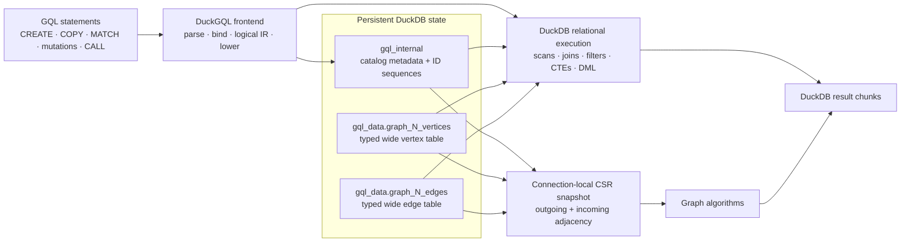
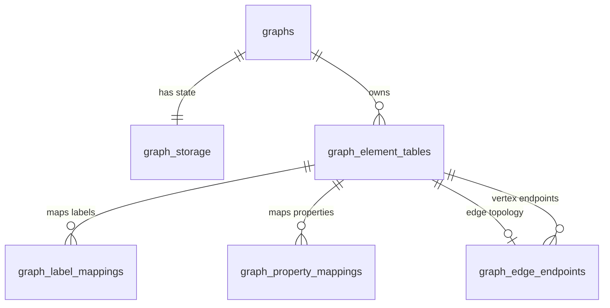

# DuckGQL storage and execution design

## Document status

This document describes the implemented DuckGQL architecture. It is the
authoritative design reference for persistent graph metadata, managed graph
tables, query execution, mutations, and the derived CSR representation.

The design is intentionally narrower than the full ISO GQL data model. Current
implementation limits are identified explicitly; they are not conformance
claims. Language conformance is tracked separately in
[`test/conformance/iso-gql-2024.tsv`](../test/conformance/iso-gql-2024.tsv).

## Design summary

DuckGQL uses DuckDB twice, for two different jobs:

1. DuckDB tables are the authoritative persistent graph store.
2. DuckDB's relational engine executes ordinary GQL pattern queries and
   mutations.

Graph algorithms use a third representation: an immutable, connection-local
CSR snapshot built explicitly from the authoritative tables. CSR is derived
state. It is never the source of truth and is not used to execute `MATCH`.



## Design goals

- Keep properties in typed DuckDB columns, not entity-attribute-value rows.
- Make DuckDB's optimizer and vectorized operators the default query engine.
- Keep catalog metadata small and independent of physical property values.
- Make bulk loading set-oriented and close to native DuckDB CTAS behavior.
- Preserve stable graph identities across relational queries and CSR builds.
- Keep CSR construction explicit so algorithm memory and freshness are visible.
- Make graph-owned storage lifecycle operations atomic.

## Non-goals in the current design

- CSR-backed execution for ordinary `MATCH`.
- A normalized EAV compatibility store.
- Zero-copy querying of external or attached tables as graph storage.
- Multiple vertex or edge tables inside one graph.
- Composite element keys or endpoint keys.
- Automatic schema evolution when a mutation references an unknown property.
- Database-wide, automatically refreshed CSR caching.

## Persistent namespaces

DuckGQL creates two DuckDB schemas:

| Schema | Purpose | Ownership |
|---|---|---|
| `gql_internal` | Graph catalog, mappings, and per-graph ID sequences | DuckGQL implementation-private |
| `gql_data` | Managed wide vertex and edge tables | Owned by the graph |

Applications should use GQL commands and public functions rather than mutate
`gql_internal` directly. The internal schema is documented here to make the
storage contract reviewable, but it is not a stable public SQL API.

## Catalog state machine

Each graph has one row in `gql_internal.graphs` and one row in
`gql_internal.graph_storage`.

| State | Meaning | Allowed lifecycle operations |
|---|---|---|
| `EMPTY` | The graph exists but has no element tables | `COPY GRAPH`, `DROP GRAPH`, inspection |
| `TABLE_BACKED` | The graph owns one vertex table and one edge table | `MATCH`, mutations, CSR build/use, `DROP GRAPH` |

The normal transition is:

```text
CREATE GRAPH
    EMPTY
      |
      | COPY GRAPH succeeds atomically
      v
TABLE_BACKED
      |
      | DROP GRAPH succeeds atomically
      v
   removed
```

`COPY GRAPH` requires an `EMPTY` graph with no element-table mappings. A failed
copy rolls back the generated tables, sequences, mappings, and state
transition. Legacy storage modes are rejected rather than migrated implicitly.

## Internal catalog schema

DuckGQL creates three global sequences:

```sql
CREATE SEQUENCE gql_internal.graph_id_seq START 1;
CREATE SEQUENCE gql_internal.element_table_id_seq START 1;
CREATE SEQUENCE gql_internal.label_mapping_id_seq START 1;
```

It also creates two sequences for every loaded graph:

```text
gql_internal.graph_<graph_id>_vertex_id_seq
gql_internal.graph_<graph_id>_edge_id_seq
```

The per-graph sequences begin at the first unused ID after bulk import. They
allocate identities for later GQL mutations and are dropped with the graph.
Sequence values are unique but are not guaranteed to be gap-free.

### Catalog relationships

The following diagram shows logical relationships. The current DDL does not
declare foreign keys; DuckGQL maintains these relationships in its lifecycle
code and deletes dependent rows in a controlled order.



### `gql_internal.graphs`

One row per logical graph.

```sql
CREATE TABLE gql_internal.graphs (
    graph_id      UBIGINT PRIMARY KEY
                  DEFAULT nextval('gql_internal.graph_id_seq'),
    graph_name    VARCHAR NOT NULL UNIQUE,
    graph_version UBIGINT NOT NULL DEFAULT 0,
    created_at    TIMESTAMP NOT NULL DEFAULT current_timestamp
);
```

| Column | Meaning |
|---|---|
| `graph_id` | Stable internal graph identity used in table and sequence names |
| `graph_name` | User-facing graph name |
| `graph_version` | Mutation generation used to detect stale CSR snapshots |
| `created_at` | Graph creation timestamp |

`graph_version` advances when managed loading or GQL mutation changes graph
contents. Direct SQL writes to managed tables do not advance it.

### `gql_internal.graph_storage`

One storage-policy row per graph.

```sql
CREATE TABLE gql_internal.graph_storage (
    graph_id        UBIGINT PRIMARY KEY,
    storage_mode    VARCHAR NOT NULL,
    default_catalog VARCHAR,
    default_schema  VARCHAR,
    schema_version  UBIGINT NOT NULL DEFAULT 0,
    csr_policy      VARCHAR NOT NULL DEFAULT 'DISABLED',
    CHECK (storage_mode IN ('EMPTY', 'TABLE_BACKED')),
    CHECK (csr_policy IN ('DISABLED', 'MANUAL', 'AUTO'))
);
```

| Column | Meaning |
|---|---|
| `graph_id` | Logical parent in `graphs` |
| `storage_mode` | `EMPTY` or `TABLE_BACKED` |
| `default_catalog` | Catalog containing the managed element tables |
| `default_schema` | Schema containing the managed element tables |
| `schema_version` | Storage mapping generation |
| `csr_policy` | CSR lifecycle policy; loaded graphs currently use `MANUAL` |

`CREATE GRAPH` writes `EMPTY`, schema version `0`, and CSR policy `DISABLED`.
Successful table attachment changes the state to `TABLE_BACKED`, increments
`schema_version`, and changes the policy to `MANUAL`.

### `gql_internal.graph_element_tables`

One row for the vertex table and one row for the edge table of a loaded graph.

```sql
CREATE TABLE gql_internal.graph_element_tables (
    element_table_id        UBIGINT PRIMARY KEY
                            DEFAULT nextval(
                                'gql_internal.element_table_id_seq'),
    graph_id                UBIGINT NOT NULL,
    element_kind            VARCHAR NOT NULL,
    catalog_name            VARCHAR NOT NULL,
    schema_name             VARCHAR NOT NULL,
    table_name              VARCHAR NOT NULL,
    key_columns             VARCHAR[] NOT NULL,
    ownership               VARCHAR NOT NULL,
    access_mode             VARCHAR NOT NULL,
    extra_properties_column VARCHAR,
    UNIQUE (graph_id, catalog_name, schema_name, table_name),
    CHECK (element_kind IN ('VERTEX', 'EDGE')),
    CHECK (ownership = 'MANAGED'),
    CHECK (access_mode IN ('READ_ONLY', 'READ_WRITE'))
);
```

The metadata shape anticipates composite keys and an overflow-property column,
but the current binder requires exactly one key column and does not use
`extra_properties_column`. All current tables have `ownership = 'MANAGED'`.

### `gql_internal.graph_edge_endpoints`

Describes how an edge table connects vertex tables.

```sql
CREATE TABLE gql_internal.graph_edge_endpoints (
    edge_table_id          UBIGINT PRIMARY KEY,
    source_vertex_table_id UBIGINT NOT NULL,
    target_vertex_table_id UBIGINT NOT NULL,
    source_columns         VARCHAR[] NOT NULL,
    target_columns         VARCHAR[] NOT NULL,
    source_key_columns     VARCHAR[] NOT NULL,
    target_key_columns     VARCHAR[] NOT NULL
);
```

The current loader points both endpoint table IDs at the graph's single vertex
table and stores one source, target, and referenced-key column in each list.

### `gql_internal.graph_label_mappings`

Maps GQL labels or edge types to physical storage.

```sql
CREATE TABLE gql_internal.graph_label_mappings (
    label_mapping_id UBIGINT PRIMARY KEY
                     DEFAULT nextval(
                         'gql_internal.label_mapping_id_seq'),
    element_table_id UBIGINT NOT NULL,
    label_name       VARCHAR,
    mapping_kind     VARCHAR NOT NULL,
    column_name      VARCHAR,
    CHECK (
        (mapping_kind = 'STATIC'
            AND label_name IS NOT NULL
            AND column_name IS NULL)
        OR
        (mapping_kind IN ('SCALAR_COLUMN', 'LIST_COLUMN')
            AND label_name IS NULL
            AND column_name IS NOT NULL)
    )
);
```

The schema reserves `STATIC` and `LIST_COLUMN` representations. The current
loader and binder create and accept exactly one `SCALAR_COLUMN` mapping per
element table:

- vertex labels map to `__gql_label`;
- edge types map to `__gql_type`.

The vertex scalar can contain multiple normalized labels separated by `;`.

### `gql_internal.graph_property_mappings`

Maps a case-insensitive GQL property name to a typed physical column.

```sql
CREATE TABLE gql_internal.graph_property_mappings (
    element_table_id UBIGINT NOT NULL,
    property_name    VARCHAR NOT NULL,
    column_name      VARCHAR NOT NULL,
    gql_type         VARCHAR NOT NULL,
    nullable         BOOLEAN NOT NULL,
    writable         BOOLEAN NOT NULL,
    PRIMARY KEY (element_table_id, property_name)
);
```

The importer creates one mapping for every non-structural property column.
`gql_type` currently records DuckDB's logical type text. The binder resolves
properties from this table instead of discovering columns by convention.

## Managed graph tables

For graph ID `N`, `COPY GRAPH` creates:

```text
<current_catalog>.gql_data.graph_N_vertices
<current_catalog>.gql_data.graph_N_edges
```

These are ordinary persistent DuckDB tables. They are authoritative for
`MATCH`, mutations, and future CSR builds. They are wide: each graph property
is represented as a typed column.

### Vertex table

The physical shape is:

```sql
CREATE TABLE gql_data.graph_N_vertices AS
SELECT
    import_row_id::UBIGINT AS __gql_id,
    normalized_labels      AS __gql_label,
    named_source_id,
    property_1,
    property_2,
    ...
FROM staged_vertices;
```

| Column | Physical type | Meaning |
|---|---|---|
| `__gql_id` | `UBIGINT` | Stable managed identity used by joins, mutations, and CSR |
| `__gql_label` | `VARCHAR` | Lowercase `;`-separated label set |
| named source ID | Source type | A named `id:ID` field retained under its declared property name |
| property columns | Typed | Imported graph properties |

### Edge table

The physical shape is:

```sql
CREATE TABLE gql_data.graph_N_edges AS
SELECT
    row_number() OVER ()::UBIGINT AS __gql_edge_id,
    source.__gql_id               AS __gql_source_id,
    target.__gql_id               AS __gql_target_id,
    normalized_type               AS __gql_type,
    property_1,
    property_2,
    ...
FROM staged_edges
LEFT JOIN gql_data.graph_N_vertices source ON ...
LEFT JOIN gql_data.graph_N_vertices target ON ...;
```

| Column | Physical type | Meaning |
|---|---|---|
| `__gql_edge_id` | `UBIGINT` | Stable managed edge identity |
| `__gql_source_id` | `UBIGINT` | Source vertex `__gql_id` |
| `__gql_target_id` | `UBIGINT` | Target vertex `__gql_id` |
| `__gql_type` | `VARCHAR` | Lowercase, trimmed edge type |
| property columns | Typed | Imported graph properties |

The `__gql_` prefix is reserved. Imports reject user property names with that
prefix so structural and property columns cannot collide.

### Logical invariants versus physical constraints

The managed tables are created by CTAS. The current implementation does not add
primary-key, unique, not-null, or foreign-key constraints to them.

With normal validation enabled, `COPY GRAPH` establishes these logical
invariants before committing:

- vertex external IDs are non-null, non-empty, and unique;
- edge types are non-null and non-empty;
- edge endpoints refer to imported vertex external IDs;
- node and edge property names are unique after normalization;
- source and target ID groups match the vertex ID group.

`OPTIONS (VALIDATE FALSE)` skips the uniqueness and endpoint scans. It is a
trusted-input mode, not a relaxed graph model. Invalid trusted input can create
duplicate identities or null endpoints that later queries or CSR construction
reject or interpret incorrectly.

Direct SQL can also bypass these invariants. It is useful for inspection and
controlled maintenance, but applications that write managed tables directly
must preserve identity, endpoint, label, property, and versioning rules.

## Import contract

`COPY GRAPH ... FORMAT GRAPH` accepts:

- `.csv`;
- `.csv.gz`;
- `.csv.zst`;
- `.parquet`.

It reads one vertex file and one edge file. The graph-header roles are:

| Input | Required roles | Optional roles |
|---|---|---|
| Vertex | exactly one `:ID` | at most one `:LABEL`, typed properties |
| Edge | exactly one `:START_ID`, one `:END_ID`, and one `:TYPE` | typed properties |

An ID group in `:START_ID(group)` and `:END_ID(group)` must match the vertex
`:ID(group)`. A named vertex ID field is stored once under its declared
property name. For example, `id:ID` becomes the public `id` column. Anonymous
`:ID` values exist only in the temporary import staging table and are discarded
after endpoints have been resolved to canonical `__gql_id` values.

### Property type mapping

| Header type | Stored DuckDB type |
|---|---|
| no explicit type | Source type; CSV input is initially read as `VARCHAR` |
| `boolean`, `bool` | `BOOLEAN` |
| `byte`, `short`, `int`, `integer`, `long` | `BIGINT` |
| `float`, `double` | `DOUBLE` |
| `string`, `char` | `VARCHAR` |
| `date` | `DATE` |
| `localtime` | `TIME_NS` |
| `localdatetime` | `TIMESTAMP_NS` |
| `datetime` | `TIMESTAMPTZ` |
| `variant` | `VARIANT`, decoded from the importer's tagged scalar encoding |
| supported scalar type plus `[]` | DuckDB `LIST` of `BOOLEAN`, `BIGINT`, `DOUBLE`, or `VARCHAR` |

CSV lists are split on `;`. Nested structural fields and unsupported property
types are rejected.

### Load phases

One transaction covers all persistent effects:

1. Verify that the graph exists and is `EMPTY`.
2. Create temporary `gql_copy_nodes` and `gql_copy_edges` staging tables with a
   generated import row number.
3. Parse graph-header roles and property types.
4. Validate IDs, types, and endpoints unless validation is disabled.
5. Create the managed vertex table with one CTAS statement.
6. Create the vertex ID sequence.
7. Create the managed edge table with endpoint joins.
8. Create the edge ID sequence.
9. Insert element, endpoint, label, and property mappings.
10. Change storage state to `TABLE_BACKED` and increment graph versions.
11. Commit.

`COPY GRAPH` is currently not allowed inside an explicit caller transaction.

## Query binding and execution

The frontend and execution path is:

```text
OpenGQL parse tree
    -> owned typed AST with source ranges
    -> binder: scopes, element bindings, labels, properties, scalar types
    -> graph-relational logical IR
    -> DuckDB parsed relational plan
    -> DuckDB optimizer
    -> DuckDB physical operators
```

At bind time, DuckGQL loads the selected graph's catalog mappings into a
`GqlTableGraphBinding`. It requires exactly one vertex table, one edge table,
one key column per table, one scalar label/type mapping per table, and one
endpoint mapping.

For a fixed directed pattern, lowering creates one table alias per vertex or
edge occurrence and connects them with equality predicates:

```text
edge.__gql_source_id = source_vertex.__gql_id
edge.__gql_target_id = target_vertex.__gql_id
```

Property references become direct typed column references. Label predicates
split the scalar label column on `;` and test membership. DuckDB remains
responsible for scan parallelism, predicate pushdown, join ordering,
aggregation, sorting, paging, and physical operator selection.

Ordered clause pipelines retain correlation boundaries in the logical IR:

- mandatory stages use `INNER_APPLY`;
- optional stages use `LEFT_APPLY`;
- a leading optional stage is anchored by `UNIT`;
- `LET` creates a clause boundary even when its scalar expression is inlined.

An anonymous unbounded directed path lowers to a recursive CTE. Its recursive
state carries the start identity, current endpoint, depth, and ordered used-edge
identities, enforcing different-edge/trail semantics.

### Projected element values

Projected graph elements are typed DuckDB structures:

- node: `STRUCT(vertex_id, __gql_labels, <mapped properties...>)`;
- edge: `STRUCT(edge_id, __gql_type, __gql_source, __gql_target,
  <mapped properties...>)`;
- fixed path: `STRUCT(nodes LIST<STRUCT>, edges LIST<STRUCT>)`.

Property fields are ordered case-insensitively for deterministic struct types.
An unmatched optional element is SQL `NULL`. Quantified path-value
materialization remains outside the current implemented boundary.

`vertex_id` and `edge_id` are the public names for the same stable managed
identities returned by `element_id()` and graph algorithms. The physical
managed-table columns remain `__gql_id` and `__gql_edge_id`.

## Mutation model

GQL mutations target the same managed wide tables used by `MATCH`.

- `INSERT` allocates IDs from the per-graph sequences and inserts canonical
  structural columns plus existing mapped property columns.
- Matched `SET` and `REMOVE` lower to typed DuckDB `UPDATE`.
- Edge and node deletion lower to DuckDB `DELETE`; non-detach node deletion
  rejects remaining incident edges.
- `DETACH DELETE` removes incident edges and vertices in one command envelope.
- Fixed directed `MATCH`-and-`INSERT` materializes one pre-mutation match
  snapshot, allocates IDs per matched row, and performs set-oriented inserts.

Autocommit mutations use a command envelope so all generated DuckDB statements
commit or roll back together. Inside an explicit caller transaction, normal
DuckDB transaction ownership and read-your-writes behavior apply.

Successful managed mutations increment `gql_internal.graphs.graph_version`.
The current mutation layer requires canonical structural column names and
pre-existing property mappings. It does not add a new property column
automatically.

## CSR snapshot design

`CALL gql_build_csr('graph_name')` reads the managed tables in a transaction and
publishes an immutable snapshot in the current DuckDB client context.

The in-memory structure is:

| Field | Role |
|---|---|
| `graph_id`, `graph_version` | Snapshot identity and freshness token |
| `vertex_ids` | Ordinal-to-managed-ID mapping; implicit for exact dense `1..N` managed IDs |
| `dense_vertex_ids` | Enables the `vertex_id - 1` fast path and omits the explicit ID vector |
| `ordinal_by_id` | Sparse managed-ID-to-ordinal fallback |
| `vertex_label_offsets`, `vertex_label_ids` | Compact per-vertex label lists |
| `outgoing_offsets` | 64-bit CSR offsets by source ordinal |
| `outgoing_neighbors` | Target ordinals, stored as 32-bit values when the vertex count permits |
| `outgoing_edge_ids` | Managed edge IDs aligned with outgoing neighbors |
| `outgoing_label_ids` | Optional edge-type IDs; a uniform edge type is stored once |
| `incoming_offsets` | 64-bit CSR offsets by target ordinal |
| `incoming_neighbors` | Source ordinals, with the same adaptive width as outgoing neighbors |
| `incoming_edge_ids` | Managed edge IDs aligned with incoming neighbors |
| `incoming_label_ids` | Optional edge-type IDs; a uniform edge type is stored once |
| `label_ids` | Case-normalized label/type string dictionary |
| `memory_bytes` | Accounted resident bytes across topology, identity, label, and auxiliary categories |

Construction uses two streamed edge passes:

1. Count incoming and outgoing degrees.
2. Prefix-sum the offsets and allocate final arrays once.
3. Scatter each edge into outgoing and incoming arrays.

Managed dense vertex IDs avoid both the ID vector and ID hash map. Sparse IDs
use `ordinal_by_id`. `gql_csr_stats` reports topology, identity, label, and
auxiliary bytes separately, plus neighbor width and whether vertex IDs or edge
labels require explicit storage. Vector capacity, hash buckets/nodes, label
strings, the snapshot object, and build-only cursor/ID buffers are included in
the appropriate accounting fields.

### Cache and invalidation

The cache is connection-local and keyed by graph identity. Every algorithm call
compares the current catalog `graph_version` with the snapshot version.
Managed GQL mutations therefore make an older snapshot stale.

Direct SQL writes do not increment `graph_version`. After any direct SQL
topology or label change, the caller must run `gql_build_csr` again explicitly.

CSR construction and CSR algorithms are not currently allowed inside explicit
caller transactions. `MATCH` never consults CSR and remains available under
normal DuckDB MVCC rules.

## Ownership and deletion

All current element tables are `MANAGED`. `DROP GRAPH` runs transactionally and:

1. drops the graph's vertex and edge ID sequences;
2. drops the managed vertex and edge tables;
3. deletes property, label, endpoint, and element-table mappings;
4. deletes storage and graph rows;
5. clears the selected graph in the current client context when applicable.

The explicit deletion order matters because the catalog currently has logical
relationships without declared foreign keys.

## External storage boundary

External systems, including DuckLake-backed tables, can be sources for files
that DuckGQL imports. The current robust path is:

```text
external or DuckLake tables
    -> export graph-header Parquet/CSV
    -> COPY GRAPH ... FORMAT GRAPH
    -> managed DuckDB graph tables
```

Direct zero-copy graphs backed by DuckLake or arbitrary attached tables are not
implemented. The current catalog and mutation path assume graph-owned tables,
DuckDB sequences, writable mapped columns, and local transactional DDL/DML.
The proposed read-only referenced-table architecture is described in the
[zero-copy DuckLake integration design](ducklake-zero-copy-design.md).

## Inspection queries

List logical graphs and live row counts:

```sql
SELECT * FROM gql_graphs();
```

Inspect storage state and physical table mappings:

```sql
SELECT
    g.graph_id,
    g.graph_name,
    g.graph_version,
    s.storage_mode,
    s.schema_version,
    s.csr_policy,
    e.element_kind,
    e.catalog_name,
    e.schema_name,
    e.table_name,
    e.key_columns
FROM gql_internal.graphs AS g
JOIN gql_internal.graph_storage AS s USING (graph_id)
LEFT JOIN gql_internal.graph_element_tables AS e USING (graph_id)
ORDER BY g.graph_name, e.element_kind;
```

Inspect property mappings:

```sql
SELECT
    e.graph_id,
    e.element_kind,
    p.property_name,
    p.column_name,
    p.gql_type,
    p.nullable,
    p.writable
FROM gql_internal.graph_element_tables AS e
JOIN gql_internal.graph_property_mappings AS p USING (element_table_id)
ORDER BY e.graph_id, e.element_kind, p.property_name;
```

Inspect a generated physical schema after discovering its graph ID:

```sql
DESCRIBE gql_data.graph_1_vertices;
DESCRIBE gql_data.graph_1_edges;
```

Inspect CSR build statistics on the connection that owns the snapshot:

```sql
SELECT * FROM gql_csr_stats('social');
```

## Design invariants

These invariants define the implemented architecture:

1. Persistent graph values live only in managed wide DuckDB tables.
2. Catalog tables contain mappings and lifecycle state, not vertex or edge
   property values.
3. A queryable graph currently has exactly one vertex and one edge table.
4. Internal vertex and edge identities are unsigned 64-bit values.
5. Edge endpoints store managed vertex identities, not external import IDs.
6. Property access is catalog-mapped and type-preserving.
7. The managed tables are authoritative; CSR is disposable derived state.
8. `MATCH` lowers to native relational or recursive DuckDB execution.
9. Managed lifecycle operations and multi-statement mutations are atomic.
10. Direct SQL writers are responsible for preserving invariants and rebuilding
    CSR because they bypass DuckGQL version tracking.

## Known limits and evolution points

The existing metadata schema leaves room for several extensions, but the
runtime does not implement them yet:

- multiple vertex and edge tables per graph;
- static and list-column label mappings;
- composite keys and endpoints;
- explicit graph schemas and richer GQL DDL;
- property-column creation and type evolution;
- zero-copy registration of externally owned tables;
- physical key, endpoint, and indexing constraints on generated tables;
- weighted CSR arrays;
- database-wide CSR publication, bounded eviction, and automatic invalidation;
- transaction-local CSR snapshots or deltas;
- quantified path-value materialization.

Any evolution should preserve the central boundary: DuckDB tables remain
authoritative, relational execution remains the default for GQL, and CSR
remains an explicit derived accelerator for algorithms.

The ranked implementation order for performance work is maintained in the
[performance design roadmap](performance-design-roadmap.md).

## Implementation map

| Concern | Primary implementation |
|---|---|
| Internal catalog DDL and graph lifecycle | [`src/gql_storage.cpp`](../src/gql_storage.cpp) |
| Catalog attachment and binding | [`src/gql_catalog.cpp`](../src/gql_catalog.cpp) |
| Graph-header parsing and bulk import | [`src/gql_import.cpp`](../src/gql_import.cpp) |
| Typed AST and logical IR | [`src/include/gql_ast.hpp`](../src/include/gql_ast.hpp), [`src/include/gql_ir.hpp`](../src/include/gql_ir.hpp) |
| Relational and recursive lowering | [`src/gql_relational.cpp`](../src/gql_relational.cpp) |
| Native table mutations | [`src/gql_mutation.cpp`](../src/gql_mutation.cpp) |
| CSR construction and cache | [`src/gql_csr.cpp`](../src/gql_csr.cpp) |
| Algorithm execution | [`src/gql_algorithms.cpp`](../src/gql_algorithms.cpp) |
| Storage lifecycle tests | [`test/sql/gql_catalog.test`](../test/sql/gql_catalog.test), [`test/sql/gql_table_backed.test`](../test/sql/gql_table_backed.test) |
| Import tests | [`test/sql/gql_copy_graph.test`](../test/sql/gql_copy_graph.test) |
| Mutation tests | [`test/sql/gql_native_insert.test`](../test/sql/gql_native_insert.test), [`test/sql/gql_native_mutation.test`](../test/sql/gql_native_mutation.test) |
| CSR and algorithm tests | [`test/sql/gql_csr_algorithms.test`](../test/sql/gql_csr_algorithms.test) |
